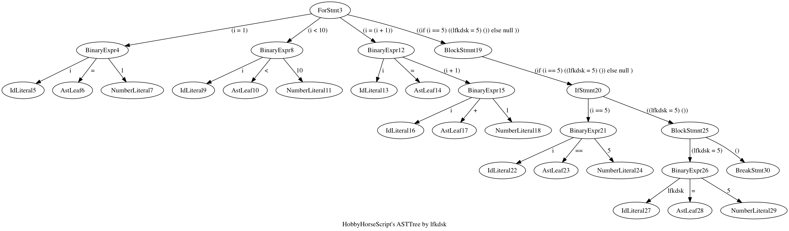

# HobbyScript

* 2016.7.12 初次更新

  完成了基础的词法分析，很不好意思，使用了正则表达式，现在能够辨别词素有字符串，ID，整形，和双精度的浮点型，因为打算做弱类型语言，所以数字类型的选择是通过自动判断的。

* 2016.7.14 文本段的解释器写完了

  能够运行定义的代码了。

  ``` java
  num = 0;
  i = 1;

  while (i < 10){
  	if (i % 2 == 0){
    		num = num + i;
  	}
    
    	i = i + 1;
  }
  num;
  ```

  类似这样的代码。

* 2016.7.16 增加了for语句，break语句，增加了函数调用。

  ```java
  function fib(n){
       if (n < 2){
           n;
       }else{
           fib(n - 1) + fib(n - 2);
       }
  }

  fib(10);
  ```

  支持诸如此类的代码。


​	昨天的时候，我写了一个小的彩蛋，使用`GraphViz`的JavaAPI去绘制运行代码的AST树，下面有一些示例，其余保存在`src/HobbyScript/Tmp/`中。

​	


* 2016.7.17 试着增加了一下闭包函数 现在有点混乱

  修改了一下，目前是能用了。

  