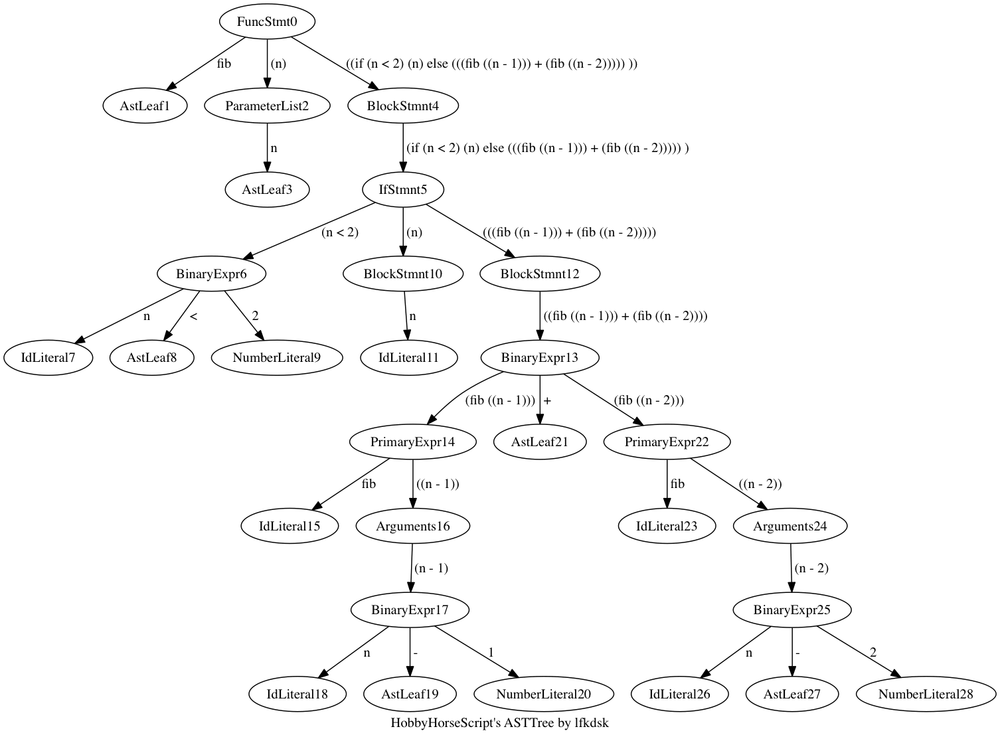
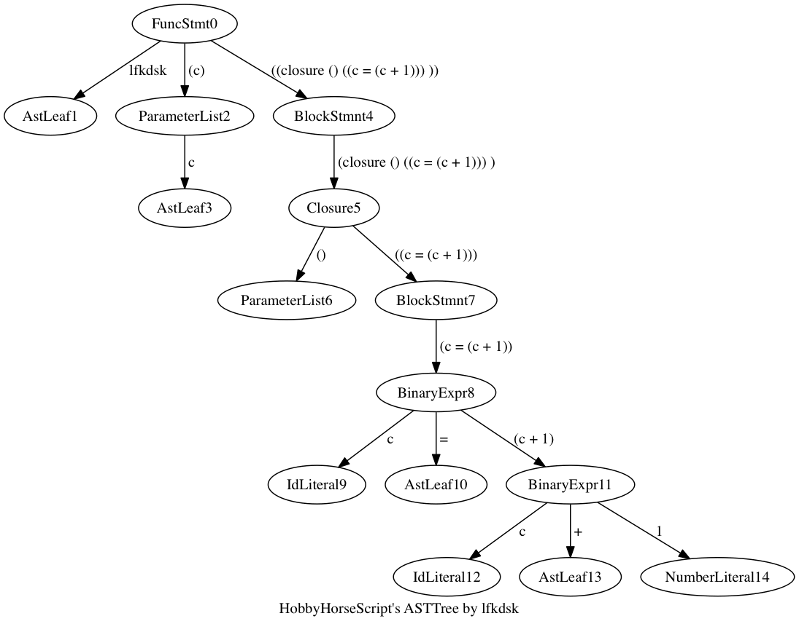
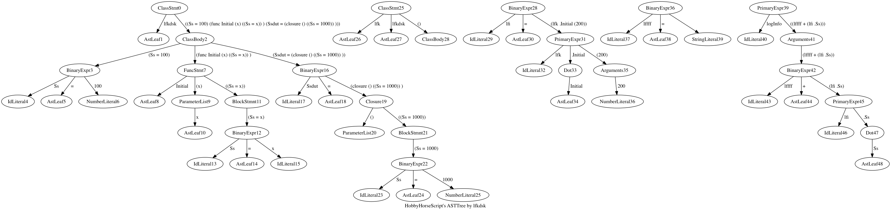

# HobbyScript

* 2016.7.12 初次更新

  完成了基础的词法分析，很不好意思，使用了正则表达式，现在能够辨别词素有字符串，ID，整形，和双精度的浮点型，因为打算做弱类型语言，所以数字类型的选择是通过自动判断的。

* 2016.7.14 文本段的解释器写完了

  能够运行定义的代码了。

  ``` java
  num = 0;
  i = 1;

  while (i < 10){
  	if (i % 2 == 0){
    		num = num + i;
  	}
    
    	i = i + 1;
  }
  num;
  ```

  类似这样的代码。

* 2016.7.16 增加了for语句，break语句，增加了函数调用。

  ```java
  function fib(n){
       if (n < 2){
           n;
       }else{
           fib(n - 1) + fib(n - 2);
       }
  }

  fib(10);
  ```

  支持诸如此类的代码。


​	昨天的时候，我写了一个小的彩蛋，使用`GraphViz`的JavaAPI去绘制运行代码的AST树，下面有一些示例，其余保存在`src/HobbyScript/Tmp/`中。

​	



* 2016.7.17 试着增加了一下闭包函数 现在有点混乱

  修改了一下，目前是能用了，能运行诸如以下的使用了闭包的代码。

  ``` java
  i = 0;
  lfkdsk = closure(n){
    	n = n + 100;
  }
  lfkdsk();
  lfkdsk();
  ```

  


* 2016.7.22 现在完成了 OOP的初次封装，支持了两种构造函数。

  ``` java
  i = 301;

  class lfkdsk {
      Ss = i;

      function Initial(x){
          Ss = i;
      }

      Ssdut = closure(){
          Ss = 1000;
      };
  }

  class lfk extend lfkdsk {
      function Lfkddd(){
          super.Ssdut();
      }
  }

  lfi = lfk.Initial(200);

  logInfo(lfi.Lfkddd() + "  " + lfi.Ss);
  ```

  ​

  


* 2016.7.23 修改了几个环境的bug，类能够很简单地表示链表等数据结构，这就有了很多的可能性。

``` java
class Node {

    value = 0;

    next = 0;

    function Initial(v){
        value = v;
    };

    function GetV(){
        value;
    };

    function SetV(v){
        value = v;
    };

    function SetN(n){
        next = n;
    }

    function GetN(){
        next;
    }
}

firstNode = Node.Initial(0);

secondNode = Node.Initial(" fuck you");

firstNode.SetN(secondNode);

logInfo(firstNode.GetN().GetV() + " ");
```

* 2016.7.24 搞定了两个基础的数据结构，独立了闭包函数，同时修复了之前几个作用域的bug。


```java
 class Node {

    Data = 0;

    Prev = 0;

    Next = 0;

    function Initial(data,prev,next){
        Data = data;
        Prev = prev;
        Next = next;
    }
}


class LinkedList {

    theSize = 0;

    modCount = 0;

    start = 0;

    end = 0;

    function Initial(){
        Clear();
    };

    function Clear(){
        start = Node.Initial(0, 0, 0);
        end = Node.Initial(0, start, 0);

        theSize = 0;
        modCount = modCount + 1;
    };

    function Size(){
        theSize;
    };

    function IsEmpty(){
        theSize == 0;
    }

    function Add(value){
        add(Size(), value);
    }

    function add(index, value){
        AddBefore(getNode(index),value);
    }

    function Get(index){
        getNode(index).Data;
    }

    function Set(index, newVal) {
        p = getNode(index);

        oldVal = p.Data;

        // logInfo(p.Data + " - " +  index);

        p.Data = newVal;

        oldVal;
    }

    function Remove(index) {
        remove(getNode(index));
    }

    function remove(p) {
        p.Next.Prev = p.Prev;
        p.Prev.Next = p.Next;

        theSize = theSize - 1;
        modCount = modCount + 1;

        p.Data;
    }

    function AddBefore(index, value){
        newNode = Node.Initial(value,index.Prev,index);

        newNode.Prev.Next = newNode;

        index.Prev = newNode;

        theSize = theSize + 1;

        modCount = modCount + 1;
    }


    function getNode(index){
        p = 0;

        if(index > -1){
            if(index < Size() + 1){
                if(index < Size() / 2){
                    p = start.Next;


                    for (i = 0; i < index; i = i + 1) {
                        p = p.Next;
                    }
                } else {

                    p = end;

                    for (i = Size(); i > index; i = i - 1) {
                        p = p.Prev;
                    }
                }

                p;
            }
        }

    }

    function PrintList(){
        size = Size();
        for(p = start.Next;size > 0; p = p.Next){
            logInfo(p.Data + " ");
            size = size - 1;
        }
    }
}

list = LinkedList.Initial();

list.Add(" fuck ");

list.Add(111);

list.Add(11e1);

//list.Remove(2);

println(list.Get(1) + "");

list.Set(1, 222);

list.PrintList();
```

  使用链表实现的LinkedList。
```java
 class ArrayList {

      DEFAULT_SIZE = 1;

      theItems = 0;

      theSize = 0;

      function Initial(){
          Clear();
      };

      function Clear(){
          theSize = 0;
          ensureCapacity(DEFAULT_SIZE);
      };

      function Size(){
          theSize;
      };

      function IsEmpty(){
          theSize == 0;
      };

      function ensureCapacity(newSize){
          if (newSize > theSize){

             old = theItems;

             theItems = <newSize>;

             for (i = 0; i < Size(); i = i + 1) {
                 theItems[i] = old[i];
             }
          }
      };

      function Add(value) {
          add(Size(),value);
      };

      function add(index,value){
          if(length(theItems) == Size()){
              ensureCapacity(Size() * 2 + 1);
          }

          for (i = theSize; i > index; i = i - 1) {

              theItems[i] = theItems[i - 1];

          }

          theItems[index] = value;

          theSize = theSize + 1;
      };

      function Get(index){
          if(index > -1){
              if(index < Size() + 1){
                  theItems[index];
              }
          }
      }

      function Set(index,value){
          if (index > -1){
              if(index < Size() + 1){
                  theItems[index] = value;
              }
          }
      }

      function Remove(index){
          removeItem = theItems[index];

          for(i = index;i < Size() -1;i = i + 1){
              theItems[i] = theItems[i + 1];
          }

          theSize = theSize - 1;

          removeItem;
      }

      function PrintList(){
          for(i = 0;i < Size();i = i + 1){
              logInfo(theItems[i] + " ");
          }
      }
  }
```

  还有使用数组实现的ArrayList，和Java原生的都很像，用起来也几乎一样。

​  现在的AST树直接生成的图片分辨率已经大得惊人了，MD里面都快渲染不出来了，所以直接放链接好了[LinkedList AST](Tmp/1469333254733.gif) 。